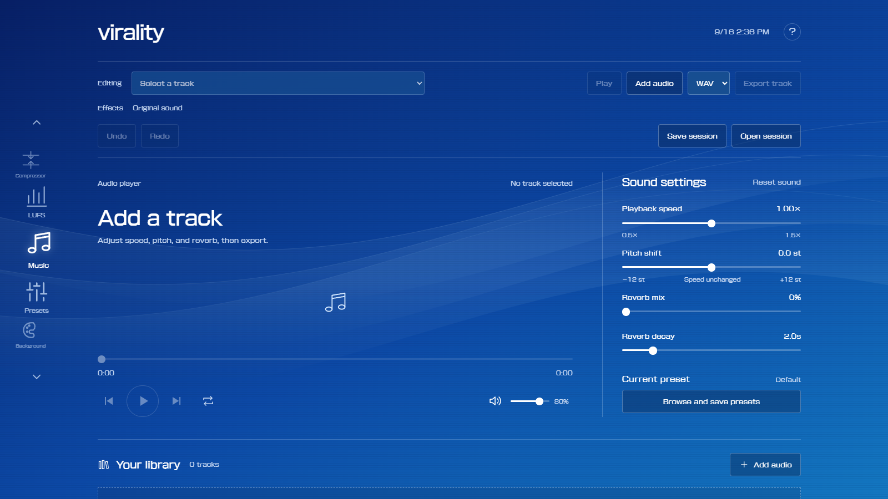

# Virality

Virality is a private, browser-based audio editor for slowed + reverb, nightcore, and custom sound design. Import a track, shape the sound with effects, preview the result, and export it without uploading your audio.

[Open Virality](https://jevendev.github.io/Virality/)

## Features

- Import one or more MP3, WAV, FLAC, M4A, OGG, and other browser-supported audio files
- Adjust playback speed, pitch, reverb mix, and reverb decay
- Shape the effect chain with an equalizer, delay, and distortion
- Preview edits with waveform scrubbing, track controls, repeat, and independent preview volume
- Use built-in sound presets or create, edit, import, and export your own
- Customize the interface colors and save portable background presets
- Undo and redo sound edits, or save the complete workspace as a session file
- Export individual tracks or the full library as WAV or MP3
- Measure integrated loudness, loudness range, true peak, and loudness over time with the built-in LUFS checker
- Navigate playback and editing controls with keyboard shortcuts

## Privacy

Audio processing and loudness analysis happen locally in your browser. Virality does not upload your tracks to an external server.

## Why I made it

Many simple audio-effect sites place basic workflows, especially batch exports, behind a paywall. I wanted a focused tool that did not require a DAW, plug-ins, or a mobile app. Virality combines my interest in interface design and music production in something practical that I can use every day.

## License

Virality is available under the [PolyForm Noncommercial License 1.0.0](LICENSE).

Created by [JVN!](https://github.com/JevenDev).